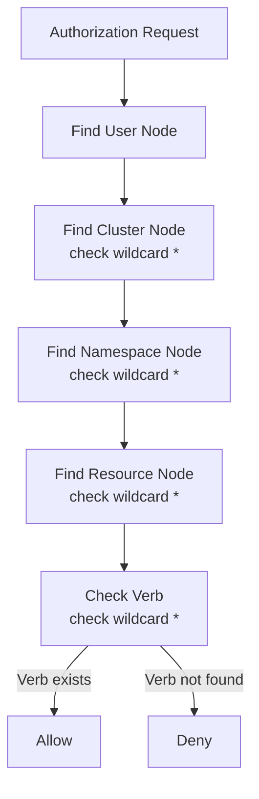

# RBAC Authorization Performance Optimization

## Problem Statement

The current RBAC authorization system in kube-oidc-proxy suffers from significant performance issues due to its nested loop structure. This becomes a bottleneck in large Kubernetes clusters with thousands of RBAC rules, causing latency spikes and poor scalability.

## Current Implementation Issues

The existing authorization flow involves:
1. Visiting rules for each binding 
2. Processing bindings through nested loops
3. Checking if binding applies
4. Getting role rules 
5. Checking each rule 

This results in poor performance that degrades as the RBAC configuration grows.

## Proposed Solution: Permission Trie Structure

Implement a hierarchical permission trie that mirrors the Kubernetes resource model:

```
User → Cluster → Namespace → Api Group → Resource → Verb
```


### Authorization Flow



### Elimination of Nested Loops

The trie structure eliminates the need for nested loops by providing:
- **O(1)** lookup for user permissions
- **Constant time** authorization regardless of RBAC rule count
- **Hierarchical wildcard support** (* for clusters, namespaces, resources, verbs)

## Implementation Requirements

1. **New PermissionTrie package** with hierarchical structure
2. **RBACAuthorizer interface** implementing the new authorization logic
3. **Integration with existing cluster manager**
4. **Comprehensive test coverage** including edge cases and wildcards
5. **Backward compatibility** with existing RBAC configurations

## Technical Details

### Key Features
- **Thread-safe** implementation with read-write mutex
- **Memory efficient** node cleanup when permissions are removed
- **Wildcard support** at all levels (cluster, namespace, apiGroup, resource, verb)
- **Resource name specificity** support for fine-grained permissions
- **Non-resource URL** permission checking


## Expected Impact

- **90-99% reduction** in authorization latency
- **Constant time performance** regardless of cluster size
- **Improved scalability** for large Kubernetes deployments
- **Reduced CPU/memory usage** for authorization operations

This optimization will significantly improve the performance and scalability of kube-oidc-proxy in enterprise environments with complex RBAC configurations.